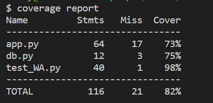

[](https://github.com/software-students-fall2023/4-containerized-app-exercise-goat/actions/workflows/CI.yml)
# Voice Math

## Description/How To Use

Voice Math is a web app which would generate easy math questions and gather your answer through microphone! 
Upon starting, a math question would show up on the screen. You can click the 'start' button to start recording your voice, and click 'finish' to stop. Once you click finish, the audio will be uploaded to the server and check its correctness. A message will be display to indicate your (transcribed) answer and whether you get it right. You can also click 'next question' to get another question. 
This app uses google cloud speech-to-text api. 
This app is especially designed for kids who is not good at addition or subtraction under ten but fluent with docker and git. 

## Contributors

- [@AlvisYan2025](https://github.com/AlvisYan2025)
- [@Jason-SL-Zhang](https://github.com/Jason-SL-Zhang)
- [@SpencerWPak](https://github.com/SpencerWPak)
- [@HenryGreene10](https://github.com/HenryGreene10)

## How to locally run this app

python(3.9 or higher), docker and git has to be installed to run this app locally. 

first clone the repository 
```bash
git clone https://github.com/software-students-fall2023/4-containerized-app-exercise-goat.git
```
or with ssh:
```bash
git clone git@github.com:software-students-fall2023/4-containerized-app-exercise-goat.git
```
then, under the main directory (4-containerized-app-exercise-goat):
build the containers
```bash
docker-compose build --no-cache
```
run docker compose
```bash
docker-compose up
```
note: the existing dockerfiles would put the machine-learning client on localhost port 3000 and the web-app on localhost port 4000. If your pc has other process taking the routes, you can change the Dockerfile and docker-compose.yaml to expose the process to another port. 

now you can access the app at localhost:4000

## Cloud Deployment 
Our app is fully deployed on Digital Ocean. To access our app on the cloud, use this address: 
```bash
http://104.131.167.165:4000/
```
Note that becuase we are using http instead of https, many browsers will block access to your microphone device due to insecure connection. This depends on your browser. Before you try our app with the above address, make sure your browser does not block the usage of microphone. 
If you are using Google Chrome, by default it blocks access to microphone with http connections. To change this, go to your chrome settings: 
```bash
chrome://flags/#unsafely-treat-insecure-origin-as-secure
```
where you can find an option "Insecure origins treated as secure", disabled by default. Enable it and add this address to the list: 
```bash
http://104.131.167.165:4000/
```
Relaunch Google Chrome and go to the same address. Now it should ask you permission to use microphone and it should work after you grant permission. 
If it still won't work, you can contact our team members..or maybe consider just run the app locally. They are the same code anyways. 
## Test Coverage
Our last commit has the following coverage: 
machine-learning-client

web-app

## Additional Notes For Graders
Our web app frontend uses a library that is written by an individual developer who currently published the code here:  https://cdn.jsdelivr.net/gh/mattdiamond/Recorderjs@08e7abd9/dist/recorder.js. It's possible that the program would stop running if the author decide to put the code somewhere else. In that case, we made a copy of the source code and we can consider using that copy. If that ever turns out to be the case, please let us know. 
